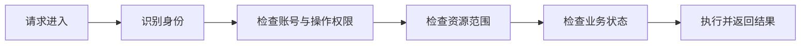

# 第 1 章：权限管理到底在管理什么

掌握深度：**重点掌握**。前置知识：能理解 HTTP 接口即可。本章不需要代码环境。

## 概念摘要

**认证（Authentication）**是验证身份。例如登录时校验密码，再在后续请求中通过会话识别用户。**授权（Authorization）**是决定该身份能否执行某项操作。登录成功并不意味着能够删除所有文章。

将一次访问写成：`主体 + 操作 + 资源 + 环境 → 允许或拒绝`。

| 要素 | 例子 | 通常从哪里取得 |
|---|---|---|
| 主体 | 用户林同学、一个服务账号 | 已验证的身份 |
| 操作 | 阅读、修改、审核 | 路由和业务方法 |
| 资源 | 文章 101 | 服务端查询到的文章 |
| 环境 | 当前时间、访问渠道 | 可信的服务端信息 |

**权限**表达可以进行的操作，如 `article:review`。**角色**是权限的业务集合，如“编辑”。**用户组**将一批用户组织起来，是否通过组授予权限由设计决定。**部门**描述组织归属，**岗位**描述工作位置。它们都可能参与授权，但不天然等于角色。

## 业务例子：作者修改文章

小林登录成功，准备修改文章 101。系统需要依次知道：

1. 当前用户是否真实登录、账号是否仍有效？
2. 是否拥有 `article:update` 功能权限？
3. 文章 101 是否处于他可以访问的数据范围？
4. 文章当前状态是否允许修改？

功能权限回答“能否使用修改功能”，数据权限回答“可以修改哪些文章”。菜单和按钮是展示入口，攻击者可以绕过页面直接请求接口，所以判断必须由后端执行。

这张图表达逻辑职责，不要求实际代码只在一个拦截器中完成全部检查。

## 易错点

- 把“登录了”当作“有权限了”。
- 根据请求中的 `userId` 认定操作者身份。请求参数是输入，不是认证证明。
- 把管理员理解为必然绕过所有规则。是否绕过需要明确设计，本课程不设置隐式万能账号。
- 认为接口允许访问，就可以在查询时不加数据范围。

## 自测

1. 小林能打开文章列表，是否意味着他能修改列表里所有文章？
2. “研发部经理”一定是一个角色吗？
3. 删除请求携带 `ownerId=自己`，是否足以证明文章属于自己？

自测答案：先自己回答再展开

1. 不意味着。读取和修改是不同操作，还要分别检查数据范围及文章状态。
2. 不一定。研发部是部门，经理可以是岗位；系统可以据此分配角色，但必须定义映射关系。
3. 不足以证明。操作者来自认证上下文，文章归属来自服务端存储，二者比较才有意义。

## 本章验收

用“你是谁、你能做什么、你能操作哪些数据”解释一次修改请求，不使用框架术语。

下一章：[访问控制模型总览](02-模型总览.md)。
