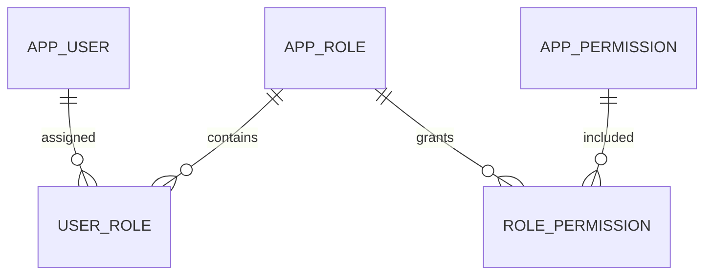

# 第 3 章：RBAC 与角色管理

掌握深度：**重点掌握**。先回顾：角色授权和检查资源归属有什么区别？

## 概念摘要与表关系

RBAC 将权限分配给角色，再将角色分配给用户。假设十名编辑都需要审核权限，将权限集中到编辑角色上，比逐个维护十份用户授权更容易解释和调整。

| 表 | 关键字段 | 约束与含义 |
|---|---|---|
| app_user | id、username、password_hash、enabled、department_id | 用户名唯一；不保存明文密码 |
| app_role | id、code、name、enabled、scope | code 唯一；scope 是本案例的数据范围扩展，不是 RBAC 必选项 |
| app_permission | code | 如 article:read、article:review，由后端定义 |
| user_role | user_id、role_id | 组合唯一；关联真实存在的用户和角色 |
| role_permission | role_id、permission_code | 组合唯一；关联已有权限 |

基础五张表是常见实现，并不是 RBAC 定义规定只能有五张表。生产系统还可能有组织、租户、会话、审计等信息。

## 权限粒度

`article:review` 表达资源类型和操作。接口负责声明它要求的权限，数据库只负责记录现有权限的分配。新建一个权限字符串不会自动保护一个接口；接口与权限检查必须接上。

角色名可以从“编辑”改为“内容编辑”，而审核接口仍检查 `article:review`。这样业务判断不会依赖可变的显示名称。

## 角色管理全过程

| 动作 | 应明确的行为 | 本项目约定 |
|---|---|---|
| 创建角色 | 编码、名称、初始权限 | 编码唯一，权限从后端字典选择 |
| 分配角色 | 谁能给谁授权 | 需要 user:manage，普通用户不能自行提权 |
| 调整权限 | 哪些用户受到影响 | 所有持有该角色的用户 |
| 停用角色 | 关联是否保留 | 保留关联，但不再贡献权限 |
| 删除角色 | 如何处理已有引用 | 已分配给用户时拒绝删除 |
| 撤销用户角色 | 是否影响其他角色 | 只移除指定关联，其他有效角色仍可贡献权限 |

本课程对有效角色的允许权限取并集，没有额外的显式拒绝授权。如果系统引入拒绝策略，需要单独定义优先级，不能沿用这个简单规则。

## 角色层级与职责分离

角色层级用于权限继承，但组织上的上下级不必然意味着权限继承。部门经理不一定需要数据库管理员权限。

**静态职责分离**可以禁止同一用户同时获得出纳和复核两个互斥角色。**动态职责分离**可以限制同一会话同时激活这些角色。“同一笔业务的申请人不能审批”还需要记录业务参与者并检查，是事务层面的职责分离，不能只依靠两个角色名。

这些概念需要理解；第一轮不实现角色继承与角色激活机制。

## RBAC 的边界与易错点

为每个“部门 × 项目 × 时间段”创建一个角色，会导致角色数量膨胀。角色适合表达稳定职责，资源范围和动态条件可以交给属性或关系规则。

另一个陷阱是将角色上的数据范围与操作权限拆开取并集。例如用户同时拥有“全部文章可读”和“本人文章可改”，不能因此获得“全部文章可改”。范围应与授予该操作的角色一起计算。

## 自测

1. 用户同时有作者和编辑角色，停用编辑后还剩什么权限？
2. 角色名称变更是否应改动审核接口？
3. 给权限表插入 article:delete，就能保护删除接口吗？
4. 只允许两种角色互斥，是否足以防止审核自己的文章？

自测答案

1. 剩余有效角色贡献的权限，不能简单清空全部权限。
2. 不应，接口检查稳定的权限编码。
3. 不能，还必须在接口或业务方法执行检查。
4. 不一定。用户可能先后换角色，仍是该文章作者；需要比较业务记录中的作者身份。

## 本章验收

不看资料画出五张表，设计作者、编辑、管理员角色，并解释每一种角色变更的影响。

下一章：[数据权限与 ABAC](04-数据权限与ABAC.md)。
