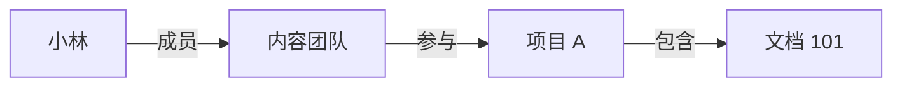

# 第 5 章：ReBAC 与资源关系

掌握深度：**理解应用**。先回顾：部门属性与项目成员关系分别适合表达什么？

## 概念摘要

ReBAC 根据主体与资源之间的关系作出授权决定。关系可以是直接的，也可以由明确规则连接多条关系得到。

只有定义了“参与项目的团队成员可以阅读项目文档”这条规则，这条路径才代表可读。图上存在一条路径不等于自动授权，更不意味着所有关系都可任意传递。

## 业务例子

- 文档的直接协作者可以编辑该文档。
- 项目成员可以读取项目中的文档。
- 父文件夹的读取关系可以按明确策略向子文档继承。

关系有方向和类型。“小林是项目成员”不意味着“项目中的所有人都能管理小林账号”。

## 如何存储与撤销

简单系统可以使用关系表：`project_member(project_id, user_id)`。查询文章时检查该文章所属项目是否存在当前用户的成员关系，不需要先引入图数据库。

删除成员关系后，下一次授权必须基于更新后的关系判断。若系统缓存关系，还需要处理失效。若用户还有另一条合法访问路径，删除一条关系并不必然撤销所有访问。

本项目只实现直接项目成员关系。图中的团队链路用于理论练习，不把它误认为参考代码已经实现的能力。

## 与其他模型的交集

RBAC 的“用户持有编辑角色”也是一种关联，但其语义是通过角色汇总权限。ReBAC 更关注用户与具体资源之间的成员、归属和继承关系。ABAC 可以把关系查询结果作为一个条件，三者可在同一系统中协作。

## 易错点

- 认为只要使用关联表就是 ReBAC。
- 无限制地继承父资源权限，不区分关系类型和操作。
- 删除一条关系后，忘记用户可能还有其他合法路径。
- 只在列表检查项目成员，详情和修改接口不检查。

## 自测

1. 用户被移出项目后，旧的 Session 是否天然保证不能访问？
2. 用户仍通过另一个团队参与项目，移除直接成员关系后是否一定不能访问？
3. 项目只读成员是否自动可以删除项目文章？

自测答案

1. 不保证，需要下一次请求重新读取关系或可靠地使缓存失效。
2. 不一定，需要按完整策略检查其他有效路径。
3. 不可以，关系必须和操作权限一起解释。

## 本章验收

画出一条间接授权路径，指出移除哪个关系会影响访问，以及是否存在其他路径。

下一章：[DAC、MAC 与 ACL 的适用边界](06-DAC-MAC-ACL的边界.md)。
